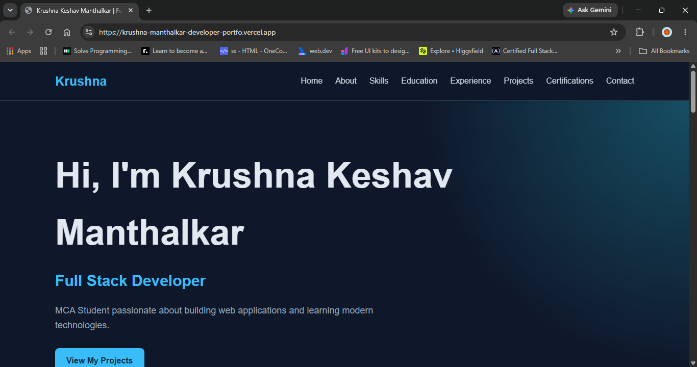
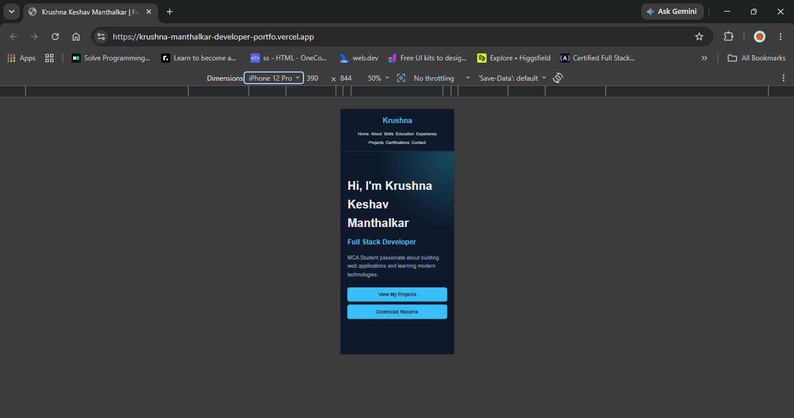
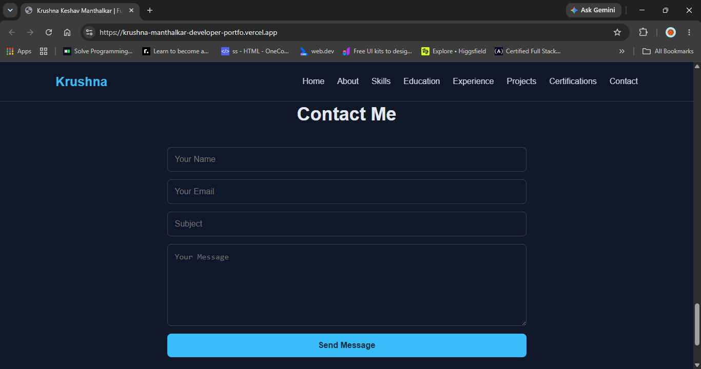
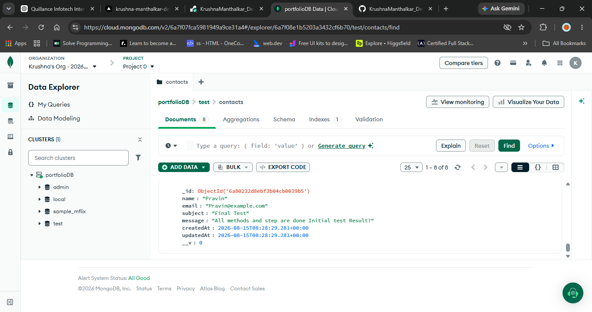

# Krushna Manthalkar — Developer Portfolio

A responsive full-stack developer portfolio website created to showcase my professional profile, technical skills, education, experience, projects, certifications, resume and contact information.

The portfolio also includes a backend contact API with MongoDB Atlas integration for storing messages submitted through the contact form.

---

## 🌐 Project Overview

This project is a full-stack developer portfolio developed as an individual mini project.

The website provides visitors with information about my background, technical skills, education, projects, certifications and professional links.

A working contact form is connected to a Node.js and Express.js backend, which stores submitted messages in MongoDB Atlas.

---

## ✨ Features

- Responsive Home and Navigation section
- About Me section
- Technical Skills section
- Education section
- Experience section
- Project showcase with multiple projects
- Certifications section
- Downloadable Resume
- GitHub profile integration
- LinkedIn profile integration
- Responsive design for mobile, tablet and desktop
- Working Contact Form
- Backend Contact API
- MongoDB Atlas database integration
- Contact messages stored in database

---

## 🛠️ Technologies Used

### Frontend

- HTML5
- CSS3
- JavaScript

### Backend

- Node.js
- Express.js

### Database

- MongoDB Atlas
- Mongoose

### Development Tools

- Visual Studio Code
- Git
- GitHub
- Thunder Client

---

## 📁 Project Structure

```text
KrushnaManthalkar_DeveloperPortfolio/
│
├── backend/
│   ├── models/
│   │   └── Contact.js
│   │
│   ├── routes/
│   │   └── contact.js
│   │
│   ├── .env
│   ├── .gitignore
│   ├── package.json
│   ├── package-lock.json
│   └── server.js
│
├── frontend/
│   ├── assets/
│   │   └── KrushnaManthalkar_resume.pdf
│   │
│   ├── index.html
│   ├── script.js
│   └── style.css
│
└── README.md
```

> Note: The `.env` file contains private configuration and is excluded from the GitHub repository using `.gitignore`.

---

## 🔗 Contact API

The portfolio contains a backend API for handling contact form submissions.

### API Endpoint

```text
POST /api/contact
```

### Local API URL

```text
http://localhost:5000/api/contact
```

### Request Format

```json
{
  "name": "Test User",
  "email": "test@example.com",
  "subject": "Portfolio Test",
  "message": "Testing contact form."
}
```

The backend receives the submitted information and stores it in MongoDB Atlas.

---

## 🗄️ Database

MongoDB Atlas is used to store contact form messages.

The application connects to MongoDB through a secure connection string stored inside the backend `.env` file.

The database configuration is not exposed publicly.

---

## ▶️ How to Run Locally

### 1. Clone the repository

```bash
git clone https://github.com/KrushnaManthalkar/KrushnaManthalkar_DeveloperPortfolio.git
```

### 2. Open the project

```bash
cd KrushnaManthalkar_DeveloperPortfolio
```

### 3. Install backend dependencies

```bash
cd backend
npm install
```

### 4. Configure environment variables

Create a `.env` file inside the `backend` folder:

```text
MONGO_URI=your_mongodb_connection_string
```

Do not upload the `.env` file to GitHub.

### 5. Start the backend

```bash
node server.js
```

The backend will run on:

```text
http://localhost:5000
```

### 6. Open the frontend

Open:

```text
frontend/index.html
```

in a browser.

---

## 📱 Responsive Design

The portfolio is designed to work across:

- Desktop
- Laptop
- Tablet
- Mobile devices

The layout, navigation, project cards, forms and content are adapted for different screen sizes.

---

## 📄 Resume

A downloadable resume is available directly from the portfolio website.

The resume is stored inside:

```text
frontend/assets/
```

---

## 🔗 Developer Profiles

### GitHub

https://github.com/KrushnaManthalkar

### LinkedIn

https://www.linkedin.com/in/krushna-manthalkar/

---

## 🚀 Live Project

### Live Portfolio

https://krushna-manthalkar-developer-portfo.vercel.app/

### Live Backend API

https://krushnamanthalkar-developerportfolio.onrender.com/

---

## 📸 Project Screenshots

### Desktop View


### Mobile View


### Contact Form Evidence


### Database Evidence


---

## 📋 Project Requirements

This project was developed to fulfill the requirements of a full-stack developer portfolio mini project, including:

- Portfolio website
- Responsive design
- Minimum three project cards
- Resume download
- GitHub and LinkedIn links
- Working contact form
- Backend API
- Database integration
- Deployment
- Project documentation

---

## 👨‍💻 Author

**Krushna Manthalkar**

BCA / MCA Student & Aspiring Full Stack Developer

GitHub:  
https://github.com/KrushnaManthalkar

LinkedIn:  
https://www.linkedin.com/in/krushna-manthalkar/

---

## 📜 License

This project was created for educational and portfolio purposes.